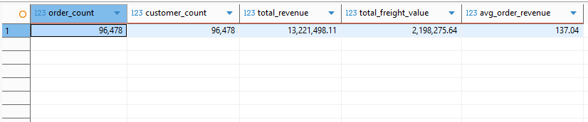
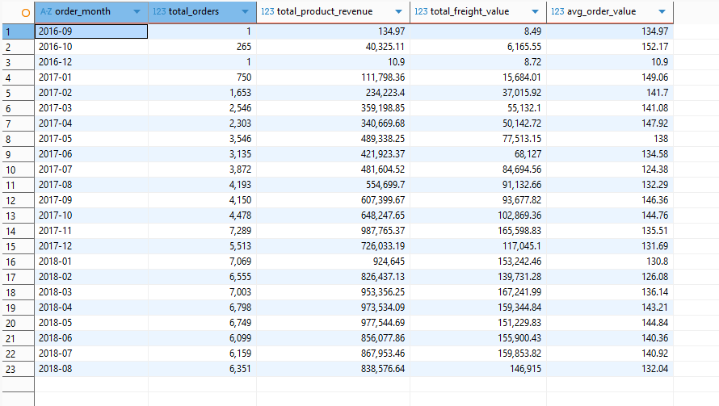
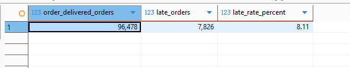
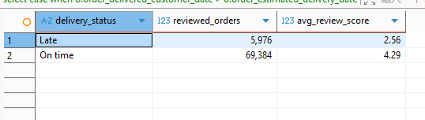
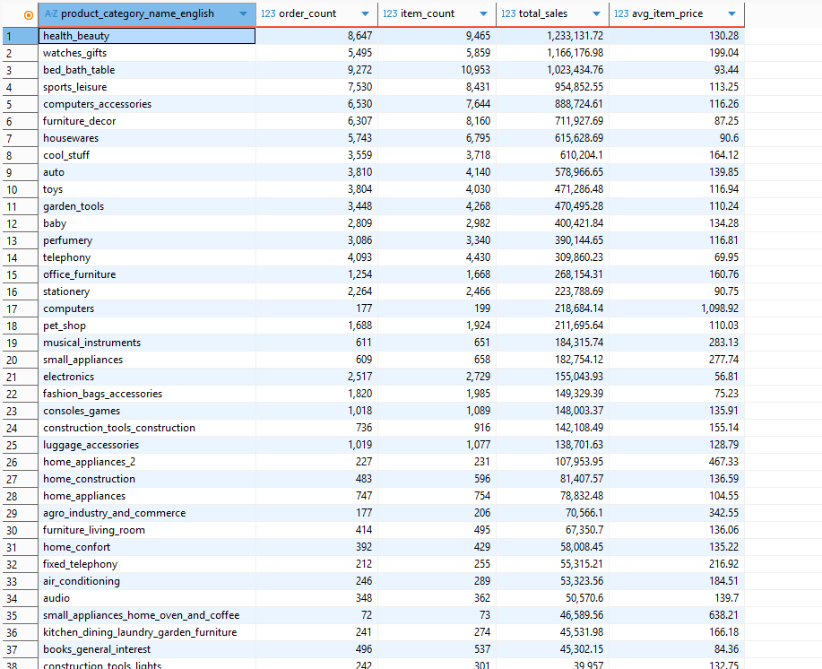
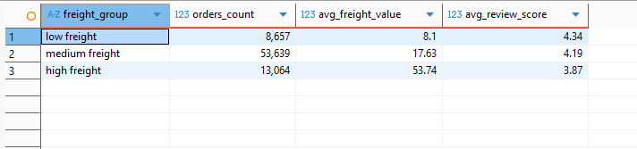

# E-commerce Delivery Performance and Customer Satisfaction Analysis Using SQL

## Project Overview

This project analyzes e-commerce delivery performance, freight cost, product categories, and customer satisfaction using the Olist Brazilian E-commerce dataset.

The goal of this project is to understand how delivery speed, late delivery, product category, and freight cost are associated with customer review scores. The analysis was completed using SQL in SQLite and DBeaver.

This project focuses on business questions related to sales performance, logistics efficiency, and customer satisfaction.

## Tools Used

* SQL
* SQLite
* DBeaver
* Olist Brazilian E-commerce Dataset

## Dataset

The analysis uses six imported tables:

| Table                       | Description                                                        |
| --------------------------- | ------------------------------------------------------------------ |
| `orders`                    | Order-level information, including order status and delivery dates |
| `customers`                 | Customer information                                               |
| `order_items`               | Item-level order details, including item price and freight value   |
| `order_reviews`             | Order-level customer review scores                                 |
| `products`                  | Product information and category names                             |
| `category_name_translation` | Product category translation table                                 |

## Important Data Rules

Several data rules were applied throughout the analysis:

* Only delivered orders were included:

  ```sql
  order_status = 'delivered'
  ```

* `order_items.price` represents product item price only and does not include freight.

* `freight_value` was analyzed separately from product sales.

* `order_items` is an item-level table, while `orders` and `order_reviews` are order-level tables.

* For order-level metrics such as average order value, total freight per order, and review score analysis, data was first aggregated or deduplicated by `order_id` to avoid double counting.

* Review score analysis only included valid scores:

  ```sql
  review_score IN (1, 2, 3, 4, 5)
  ```

## Project Structure

```text
olist-sql-delivery-analysis/
├── README.md
├── sql/
│   ├── 01_data_validation.sql
│   ├── 02_business_overview.sql
│   ├── 03_monthly_sales_trend.sql
│   ├── 04_delivery_performance.sql
│   ├── 05_customer_satisfaction.sql
│   ├── 06_category_analysis.sql
│   └── 07_freight_analysis.sql
└── screenshots/
    ├── business_overview.png
    ├── monthly_sales_trend.png
    ├── late_delivery_rate.png
    ├── late_delivery_review_score.png
    ├── top_sales_categories.png
    └── freight_review_score.png
```

## Business Questions

This project answers the following business questions:

### Business Overview

1. How many delivered orders are included in the dataset?
2. What is the total product sales amount from delivered orders?
3. What is the average order value?

### Monthly Sales Trend

4. How did monthly order volume and sales change over time?

### Delivery Performance

5. What is the average delivery time for delivered orders?
6. What percentage of delivered orders were delivered late?
7. How did average delivery time change by month?

### Customer Satisfaction

8. What is the distribution of review scores?
9. How does average delivery time differ by review score?
10. How does late delivery relate to average review score?

### Category Analysis

11. Which product categories generated the highest sales?
12. Which product categories had the best and worst average review scores?

### Freight Analysis

13. What is the average freight value by product category?
14. How does freight cost relate to average review score?

## Key Findings

### 1. Business Overview

The dataset included 96,478 delivered orders in the main analysis.

Product revenue was calculated using `order_items.price`, which does not include freight value. Freight cost was analyzed separately.



### 2. Monthly Sales Trend

Monthly order volume and product sales increased significantly after early 2017. The earliest months had very small order volumes, so sales patterns in those months should be interpreted carefully.



### 3. Delivery Performance

The average delivery time for delivered orders was 12.56 days.

Among 96,478 delivered orders, 7,826 orders were delivered later than the estimated delivery date. This resulted in a late delivery rate of 8.11%.



Monthly delivery time varied over time. Early months had small sample sizes, while delivery time was higher in late 2017 and early 2018 and improved by mid-to-late 2018.

### 4. Customer Satisfaction

Customer reviews were generally positive. Among valid review scores:

| Review Score | Review Count | Percentage |
| -----------: | -----------: | ---------: |
|            1 |        9,001 |     11.55% |
|            2 |        2,469 |      3.17% |
|            3 |        6,413 |      8.23% |
|            4 |       15,080 |     19.35% |
|            5 |       44,954 |     57.69% |

5-star reviews accounted for the largest share of valid reviews. However, 1-star reviews still represented a meaningful negative customer experience group.

Average delivery time was strongly related to review score:

| Review Score | Average Delivery Days |
| -----------: | --------------------: |
|            1 |                 21.28 |
|            2 |                 16.42 |
|            3 |                 14.27 |
|            4 |                 12.29 |
|            5 |                 10.66 |

Lower review scores were associated with longer delivery times.

Late delivery was also strongly associated with lower customer satisfaction:

| Delivery Status | Reviewed Orders | Average Review Score |
| --------------- | --------------: | -------------------: |
| Late            |           6,000 |                 2.56 |
| On Time         |          69,687 |                 4.29 |



### 5. Product Category Sales

The top revenue-generating product categories included:

* health_beauty
* watches_gifts
* bed_bath_table
* sports_leisure
* computers_accessories



These categories contributed strongly to total product sales.

### 6. Category-Level Customer Satisfaction

Average review scores varied across product categories.

To make the comparison more reliable, categories with fewer than 100 distinct orders were excluded from the category-level satisfaction analysis. This helped reduce the impact of small-sample categories.

Because `order_items` is an item-level table and `order_reviews` is an order-level table, the analysis first created a distinct combination of `order_id` and product category before joining with review scores. This avoided duplicate review score counting.

### 7. Freight Analysis

Some product categories had much higher average freight values than others. Large or heavy product categories tended to have higher freight costs.

Freight cost was grouped into low, medium, and high freight orders:

| Freight Group  | Orders | Average Freight Value | Average Review Score |
| -------------- | -----: | --------------------: | -------------------: |
| Low Freight    |  8,657 |                  8.10 |                 4.34 |
| Medium Freight | 53,639 |                 17.63 |                 4.19 |
| High Freight   | 13,064 |                 53.74 |                 3.87 |

Higher freight cost was associated with lower average review scores.



## SQL Techniques Used

This project uses the following SQL techniques:

* Filtering with `WHERE`
* Aggregation with `COUNT`, `SUM`, `AVG`, and `ROUND`
* Grouping with `GROUP BY`
* Sorting with `ORDER BY`
* Multi-table joins
* Common Table Expressions using `WITH`
* `COUNT(DISTINCT ...)`
* Date calculations using `julianday`
* Month extraction using `strftime`
* Conditional grouping using `CASE WHEN`
* Sample size filtering using `HAVING`

## Business Recommendations

Based on the analysis, delivery performance should be a key operational focus because late delivery was strongly associated with lower customer satisfaction.

The company should also monitor product categories with high freight costs, especially large or heavy categories. Reducing freight cost, improving delivery transparency, or setting better customer expectations may help improve customer experience.

Category-level review analysis can also help identify product groups that may need better seller quality control, delivery management, or customer service support.

## Conclusion

This SQL project shows that delivery performance and freight cost are closely related to customer satisfaction in e-commerce.

Delivered orders with longer delivery times and late deliveries had lower average review scores. Higher freight cost was also associated with lower customer ratings.

Through SQL-based analysis, this project provides insights into sales performance, logistics efficiency, product category performance, and customer experience for an e-commerce marketplace.
